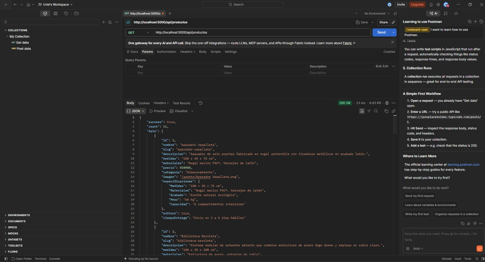
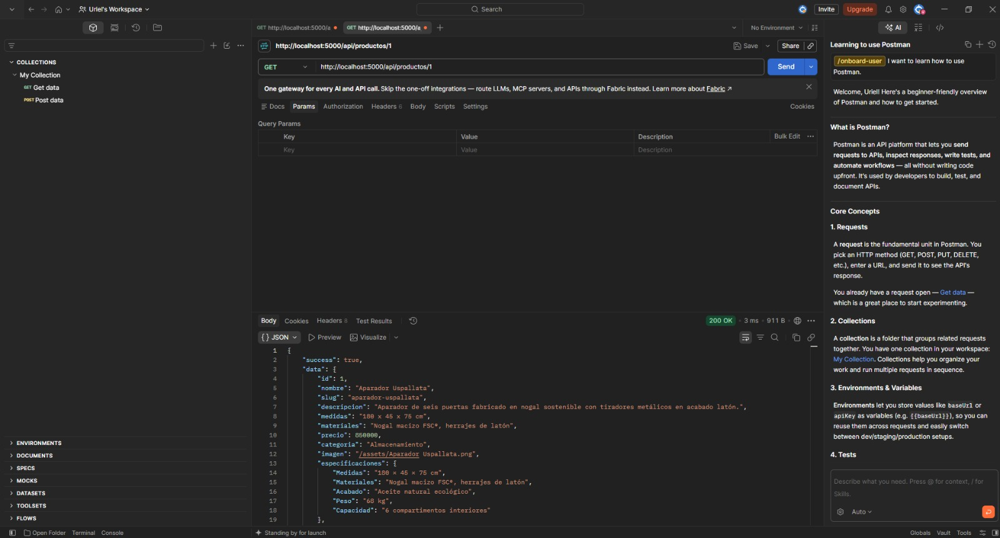
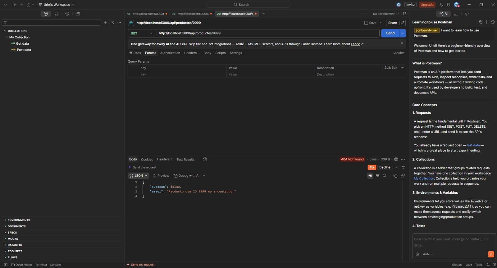
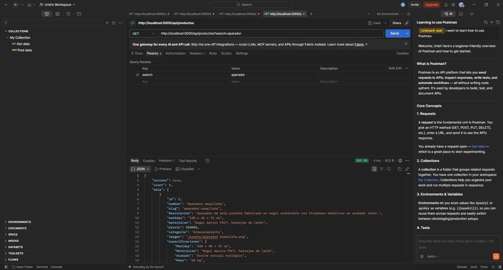
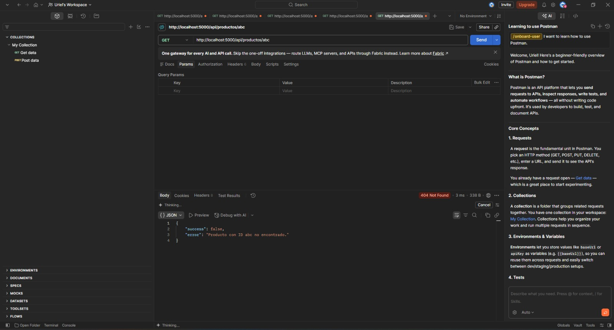
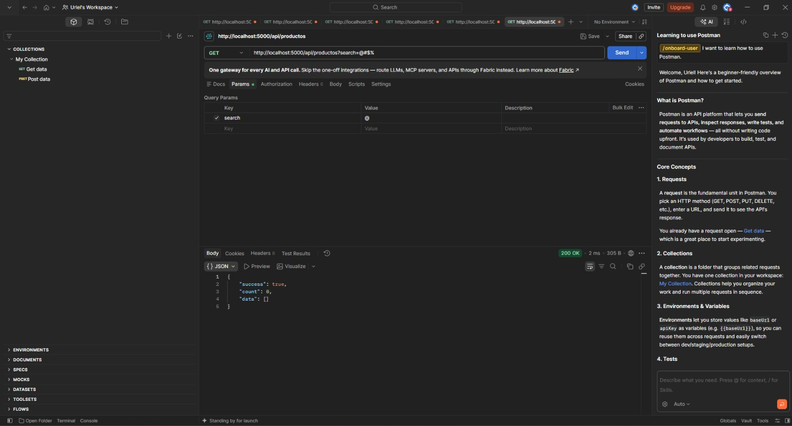
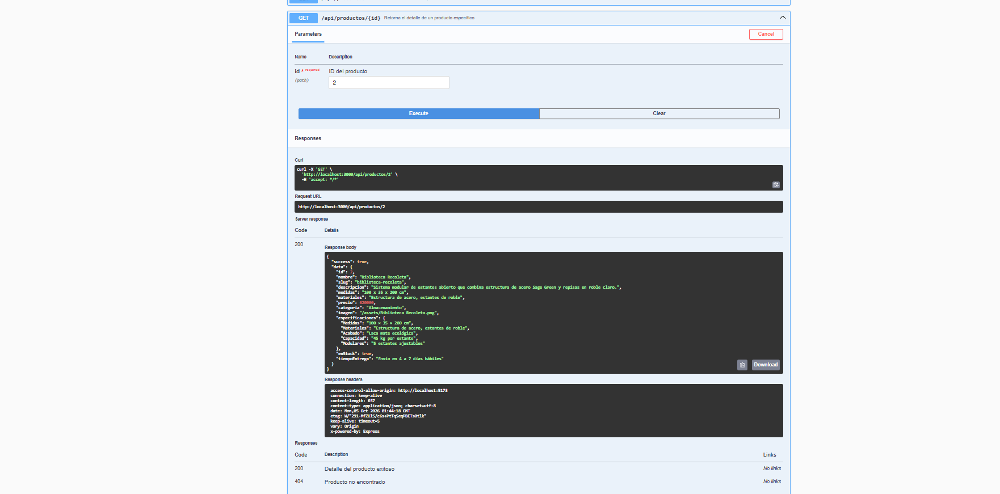
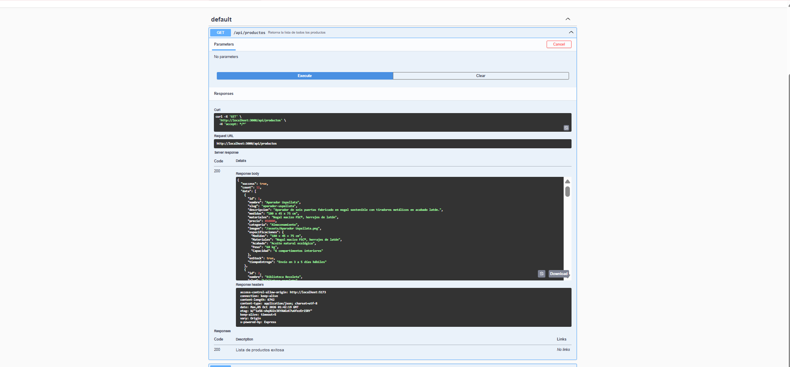

# Mueblería Hermanos Jota — E-Commerce Full Stack

Proyecto web integral para la mueblería artesanal contemporánea **Hermanos Jota**, desarrollado para los **Sprints 3 y 4**. La solución conecta un cliente interactivo construido en React y Vite con una API REST desarrollada en Node.js y Express bajo el patrón arquitectónico Modelo-Vista-Controlador (MVC).

---

## 👥 Integrantes

- **Manrique Castro, Ulises Gabriel**
- **Peralta Cassutti, Noah Nicanor**
- **Ponce, Uriel Joaquín**
- **Rolón, Clara Sofía**
- **Colque, Jimena**


---

## 🏛️ Arquitectura del Proyecto

El repositorio está organizado en dos componentes desacoplados:

```text
muebleria-jota/
├── backend/            # Servidor y API REST (Node.js, Express, MVC, ES Modules)
│   ├── src/
│   │   ├── config/     # Variables de entorno
│   │   ├── controllers/# Lógica de negocio y manejo de req/res
│   │   ├── data/       # Dataset oficial de productos
│   │   ├── middleware/ # Logger global y manejo centralizado de 404/errores
│   │   ├── models/     # Capa de datos (abstracción del catálogo)
│   │   ├── routes/     # Endpoints con express.Router()
│   │   └── app.js      # Configuración de Express
│   └── server.js       # Inicialización del servidor
│
├── clients/            # Cliente Frontend (React + Vite)
│   ├── public/         # Imágenes del catálogo de muebles y assets estáticos
│   └── src/
│       ├── components/ # Navbar, Footer, ProductCard, ProductList, ProductDetail, ContactForm, CartModal
│       ├── pages/      # HomePage, CatalogPage, DetailPage, ContactPage
│       ├── services/   # Consumo de API REST vía fetch
│       └── styles/     # Tokens y paleta oficial (Manual de Marca)
│
└── legacy-sprint-1-2/  # Resguardo histórico de archivos estáticos previos
```

---

## 🚀 Instalación y Puesta en Marcha

### Prerrequisitos
- **Node.js** (versión 18 o superior recomendada)
- **npm**

### 1. Servidor Backend

En una terminal ubicada en la raíz del proyecto:

```bash
# Ingresar a la carpeta del backend
cd backend

# Instalar dependencias
npm install

# Iniciar en modo desarrollo
npm run dev

# O en modo producción
npm start
```
El servidor quedará disponible en: http://localhost:3000

#### Endpoints de la API y Documentación (Swagger): 
- Documentación Interactiva (Swagger): Disponible en http://localhost:3000/api-docs/ para probar visualmente los endpoints.
- `GET /` : Estado del servidor y mapa de endpoints.
- `GET /api/productos` : Listado completo de muebles en formato JSON (admite `?search=`).
- `GET /api/productos/:id` : Detalle de un mueble específico por ID (retorna 404 si no existe).  

> ⚠️ **Nota de Configuración:** Dejamos las configuraciones en **`true`** intencionalmente porque estamos en un entorno académico y de aprendizaje. En producción, recuerden configurarlo siempre en **`false`**.

---

### 2. Cliente Frontend (React + Vite)

En una segunda terminal (o pestaña separada):

```bash
# Ingresar a la carpeta del frontend
cd clients

# Instalar dependencias
npm install

# Iniciar servidor de desarrollo de Vite
npm run dev
```
La aplicación web se abrirá automáticamente en: `http://localhost:5173`

---

## 🎨 Identidad Visual y Manual de Marca

La interfaz implementa las especificaciones del **Manual de Marca Hermanos Jota 2026**:
- **Colores oficiales**:
  - Siena Tostado: `#A0522D` (principal y botones de acción)
  - Verde Salvia: `#87A96B` (acentos y sustentabilidad)
  - Alabastro Cálido: `#F5E6D3` (superficies y fondos suaves)
  - Vara de Oro: `#D4A437` (detalles premium)
  - Rosa Polvoriento: `#C47A6D` (calidez)
- **Tipografías**:
  - Títulos y acentos: *Playfair Display*
  - Textos y componentes de UI: *Inter*

---

## 🛠️ Tecnologías Utilizadas

- **Frontend**: React 18, Vite, Hooks (`useState`, `useEffect`), CSS puro con variables y Grid/Flexbox, `localStorage`.
- **Backend**: Node.js, Express, ES Modules (`import/export`), `express.Router`, `cors`, `dotenv`.
- **Patrón de diseño**: MVC (Model-View-Controller) desacoplado mediante API REST.


## 🧪 Pruebas y Endpoints (Postman)

A continuación se detallan las evidencias de las pruebas realizadas sobre los diferentes endpoints de la API para asegurar su correcto funcionamiento:

### 1. Obtener todos los productos
Consulta general para listar el inventario completo.


### 2. Obtener producto por ID válido
Consulta exitosa de un producto específico mediante su ID numérico.


### 3. Manejo de error: ID no encontrado
Validación cuando se busca un ID numérico que no existe en la base de datos (Retorna `404 Not Found`).


### 4. Filtrado de productos mediante parámetros (`search`)
Prueba de búsqueda por término utilizando query params.


### 5. Manejo de error: ID con formato inválido
Validación de entrada cuando se ingresan letras u otros caracteres en lugar de un número en el ID (Retorna `404 Not Found`).


### 6. Búsqueda sin coincidencias o caracteres especiales
Comprobación de la respuesta de la API ante consultas vacías o sin resultados (Devuelve una lista vacía con estado `200 OK`).


### 📖 Pruebas en Swagger UI (Documentación Interactiva)

#### 1. Obtener producto por ID desde Swagger
Prueba de consulta de un producto específico ingresando un ID válido con respuesta exitosa.


#### 2. Obtener producto todos los productos desde Swagger
Prueba de consulta de un producto específico ingresando un ID válido con respuesta exitosa.



